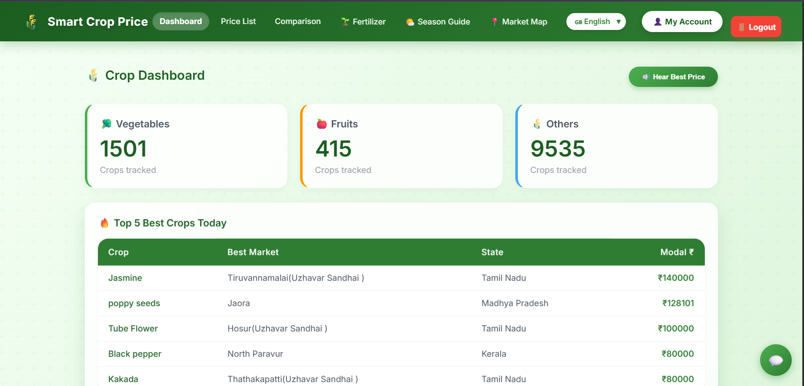

# Best Time to Sell Crop 🌾

A comprehensive agricultural analytics platform that helps farmers make informed decisions about when to sell their crops based on real-time market price data, weather conditions, and fertilizer/disease recommendations.



## 📋 Table of Contents

- [Features](#features)
- [Tech Stack](#tech-stack)
- [Project Structure](#project-structure)
- [Installation](#installation)
- [Usage](#usage)
- [API Endpoints](#api-endpoints)
- [Contributing](#contributing)
- [License](#license)

## ✨ Features

### 🎯 Core Features
- **Price Analytics** - Real-time crop price monitoring and trend analysis
- **Smart Sell Recommendations** - Get AI-powered suggestions on the best time to sell your crops
- **Crop Comparison** - Compare prices and trends across different crops
- **Price Alerts** - Set custom price alerts and receive notifications

### 🌱 Agricultural Insights
- **Fertilizer Recommendations** - Get tailored fertilizer suggestions based on crop type and conditions
- **Disease Detection & Management** - Identify and manage crop diseases with expert recommendations
- **Crop Categories** - Browse and organize crops by category
- **Market Dashboard** - Comprehensive view of top-performing and recommended crops

### 💻 User Experience
- **Multi-language Support** - Use the app in your preferred language
- **Interactive Charts** - Visual price trend analysis with Chart.js
- **Responsive Design** - Works seamlessly on desktop and mobile devices
- **User Accounts** - Save favorites and personalize your experience

## 🛠️ Tech Stack

### Backend
- **Framework:** Flask 2.3.3
- **Language:** Python
- **Data Processing:** Pandas, NumPy
- **Visualization:** Matplotlib, Seaborn
- **API:** RESTful API with CORS support
- **Data Source:** Agmarknet API for real-time price data

### Frontend
- **Framework:** React 18.2.0
- **Routing:** React Router v7.11.0
- **Charting:** Chart.js with react-chartjs-2
- **Styling:** CSS3
- **Build Tool:** Create React App (react-scripts 5.0.1)

## 📁 Project Structure

```
best_time_to_sell_crop/
├── main.py                          # Data fetching script
├── requirements.txt                 # Python dependencies
├── README.md                       # This file
│
├── backend/                        # Flask API server
│   ├── app.py                     # Flask application & routes
│   ├── api.py                     # API endpoints
│   ├── models.py                  # Data models
│   ├── fetcher.py                 # Data fetching utilities
│   ├── check_crops.py             # Crop analysis logic
│   ├── requirements.txt            # Backend dependencies
│   └── data/
│       └── crops.csv              # Crop price database
│
└── frontend/                       # React web application
    ├── package.json               # NPM dependencies
    ├── public/
    │   └── index.html             # HTML entry point
    ├── src/
    │   ├── App.js                 # Main app component
    │   ├── index.js               # React DOM render
    │   ├── App.css                # Global styles
    │   ├── pages/                 # Page components
    │   │   ├── Dashboard.js
    │   │   ├── LoginPage.js
    │   │   ├── AccountPage.js
    │   │   ├── PriceListPage.js
    │   │   ├── FertilizerPage.js
    │   │   ├── DiseaseFertilizerPage.js
    │   │   └── ComparisonPage.js
    │   ├── components/            # Reusable components
    │   │   ├── Navbar.js
    │   │   ├── CategoryList.jsx
    │   │   ├── PriceList.js
    │   │   ├── PriceListGraph.js
    │   │   ├── ComparisonChart.js
    │   │   ├── FertilizerRecommendation.jsx
    │   │   ├── FavoriteCrops.jsx
    │   │   ├── TopBestCrops.jsx
    │   │   ├── PriceAlertSettings.js
    │   │   └── LanguageToggle.js
    │   ├── context/               # React context for state
    │   │   └── AuthContext.js
    │   ├── data/                  # Static data files
    │   ├── utils/                 # Utility functions
    │   │   ├── translations.js
    │   │   ├── cropCategories.js
    │   │   ├── sellDecision.js
    │   │   ├── speakText.js
    │   │   └── ...
    │   └── pages/CSS files        # Component styles
    └── build/                      # Production build output
```

## 🚀 Installation

### Prerequisites
- Python 3.8+
- Node.js 14+
- npm 6+

### Backend Setup

1. **Navigate to the backend directory:**
```bash
cd backend
```

2. **Create a virtual environment:**
```bash
python -m venv venv
source venv/bin/activate  # On Windows: venv\Scripts\activate
```

3. **Install dependencies:**
```bash
pip install -r requirements.txt
```

4. **Set up environment variables:**
Create a `.env` file in the root directory:
```env
API_KEY=your_agmarknet_api_key
FLASK_ENV=development
```

5. **Run the Flask server:**
```bash
cd backend
python app.py
```
The server will run on `http://localhost:5000`

### Frontend Setup

1. **Navigate to the frontend directory:**
```bash
cd frontend
```

2. **Install dependencies:**
```bash
npm install
```

3. **Start the development server:**
```bash
npm start
```
The app will open at `http://localhost:3000`

## 📖 Usage

### Main Script (Data Fetching)
```bash
python main.py
```
Fetches real-time crop price data from the Agmarknet API and saves it locally.

### Development
- **Backend:** Run Flask server on port 5000
- **Frontend:** Run React dev server on port 3000
- **Frontend Build:** `npm run build` in the frontend directory

### Production Build
```bash
cd frontend
npm run build
```
Creates an optimized production build in the `build/` directory.

## 🔌 API Endpoints

### Available Endpoints

- `GET /` - Health check endpoint
- `GET /api/data` - Get all crop price data from CSV

## 🤝 Contributing

Contributions are welcome! To contribute:

1. Fork the repository
2. Create a feature branch (`git checkout -b feature/AmazingFeature`)
3. Commit your changes (`git commit -m 'Add some AmazingFeature'`)
4. Push to the branch (`git push origin feature/AmazingFeature`)
5. Open a Pull Request

## 📄 License

This project is private and for internal use. All rights reserved.

## 📧 Contact & Support

For questions or support, please contact the development team.

---

**Built with ❤️ for farmers and agricultural professionals**

